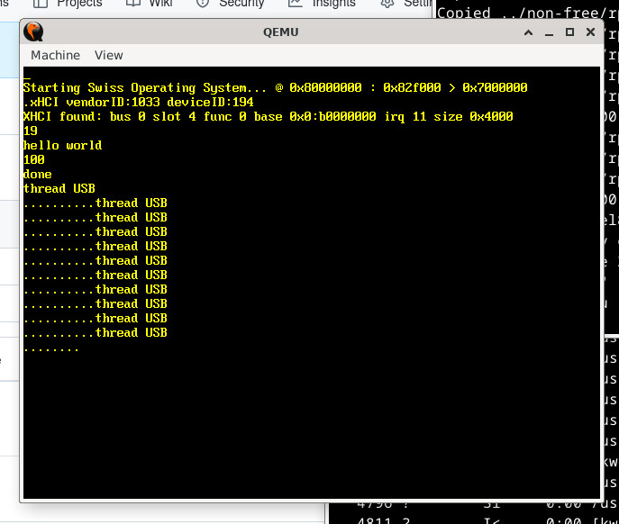

                        
# the Swiss Operating System

## [https://swiss-os.com](https://swiss-os.com)

## License

See individual files for license terms.

REFERENCES :
------------

https://www.redhat.com/en/topics/linux

https://www.microsoft.com/en-us/windows

https://www.apple.com/macos

https://repo.huaweicloud.com/harmonyos/os/5.1.0-Release/

